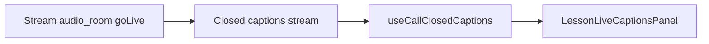

# Vision agent fixes + live captions

## Verification summary

| Finding                                                                         | Status                                                                 | Action                                                 |
| ------------------------------------------------------------------------------- | ---------------------------------------------------------------------- | ------------------------------------------------------ |
| [`lib/vision-agent/server.ts`](lib/vision-agent/server.ts) fetch has no timeout | **Valid** — lines 9–16 and 41–43 use bare `fetch()`                    | Add shared `fetchVisionAgent()` with `AbortController` |
| [`vision-agent/main.py`](vision-agent/main.py) `custom` can be `None`           | **Valid** — `getattr(..., {})` does not coerce `None`                  | Use `getattr(..., None) or {}`                         |
| [`prompts/17-live-captions.md`](prompts/17-live-captions.md) live captions      | **Partially done** — infra exists, UI unwired after PTT simplification | Re-add captions-only panel on lesson screen            |

**Skipped (already correct):**

- `start_closed_caption: true` in [`lib/stream/server.ts`](lib/stream/server.ts) line 162 — no change needed.
- [`LessonSubtitlesLive.tsx`](components/audio-lesson/LessonSubtitlesLive.tsx) already uses `useCallClosedCaptions()` and labels Teacher vs You via `ai-language-teacher`.

---

## 1. Fetch timeouts — [`lib/vision-agent/server.ts`](lib/vision-agent/server.ts)

Add a small helper (no new dependencies):

```ts
const DEFAULT_FETCH_TIMEOUT_MS = 5000;

function getFetchTimeoutMs(): number {
  const raw = process.env.VISION_AGENT_FETCH_TIMEOUT_MS;
  // parse; fallback to 5000
}

async function fetchVisionAgent(
  url: string,
  init?: RequestInit,
): Promise<Response> {
  const controller = new AbortController();
  const timeoutId = setTimeout(() => controller.abort(), getFetchTimeoutMs());
  try {
    return await fetch(url, { ...init, signal: controller.signal });
  } catch (error) {
    if (error instanceof Error && error.name === "AbortError") {
      throw new Error(`Vision Agent request timed out after ${timeoutMs}ms`);
    }
    throw error;
  } finally {
    clearTimeout(timeoutId);
  }
}
```

Use `fetchVisionAgent` in both `startAgentSession` and `stopAgentSession`. Log timeout via existing `console.error` paths.

Optional env: `VISION_AGENT_FETCH_TIMEOUT_MS` (document in comment only; no README edit unless you want it).

---

## 2. None-safe `custom` — [`vision-agent/main.py`](vision-agent/main.py)

One-line fix at line 45:

```python
custom = getattr(response.call, "custom", None) or {}
```

`ai_teacher_prompt` and downstream `custom.get(...)` calls remain unchanged and safe.

---

## 3. Live captions — prompt 17

Goal: realtime captions for **teacher + user** during an active call, without bringing back the old subtitles toggle, camera, or static lesson cheat-sheet panel.



### New: [`components/audio-lesson/LessonLiveCaptionsPanel.tsx`](components/audio-lesson/LessonLiveCaptionsPanel.tsx)

- Lazy-import [`LessonSubtitlesLive`](components/audio-lesson/LessonSubtitlesLive.tsx) (same pattern as old panel; keeps SDK out of Expo Go bundle path).
- Return `null` in Expo Go.
- Scrollable card (`max-h-40`), title **Live captions**, placeholder before SDK loads.
- `onContentSizeChange` → scroll to end as new lines arrive.

### Update: [`components/audio-lesson/LessonSubtitlesLive.tsx`](components/audio-lesson/LessonSubtitlesLive.tsx)

- Optional prop `onCaptionsChange?: () => void` — `useEffect` when `captions.length` changes (for auto-scroll).
- Empty state: **Waiting for speech…** (inside panel, not hidden).
- Extract `AGENT_USER_ID` constant (matches server/agent).

### Wire: [`app/lesson/[id].tsx`](app/lesson/[id].tsx)

After `TeacherPreviewCard`, inside `StreamCallProvider` tree:

```tsx
{
  !inPreviewMode && status === "joined" ? <LessonLiveCaptionsPanel /> : null;
}
```

**Not changed:** [`LessonSubtitlesPanel.tsx`](components/audio-lesson/LessonSubtitlesPanel.tsx) — remains unused (static goals/phrases); avoids reintroducing removed subtitles UX.

---

## Validation

```bash
npm run typecheck
npm run lint
```

Manual (dev build):

1. Start lesson → live captions panel visible when joined.
2. Teacher speaks → **Teacher** lines appear.
3. Hold mic and speak → **You** lines appear.
4. Stop vision-agent with bad URL / delay → API returns timeout error within ~5s instead of hanging.
5. Call with `custom: null` in Stream → agent joins without crash (restart vision-agent after `main.py` change).

Restart **vision-agent** after Python change.
